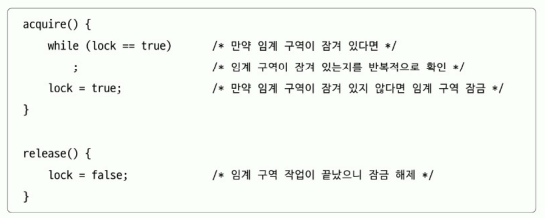

# 12장. 프로세스 동기화

# 12.1 동기화란

<aside>
💡동시다발적으로 실행되는 프로세스들은 서로 협력하며 작업을 수행.
    이 과정에서 자원의 일관성을 보장.

</aside>

 

### 의미

- 동기화는 프로세스들이 서로 협력하여 작업을 수행하는 것을 의미한다.
- 동기화에는 실행 순서 제어를 위한 동기화와 상호 배제를 위한 동기화가 있다.

  - 실행 순서 제어를 위한 동기화: reader writer 문제

- Writer: 파일에 값을 저장하는 프로세스
- Reader: 파일에서 값을 읽어오는 프로세스
  - 둘은 실행의 순서가 있다. Reader 프로세스는 Writer 프로세스가 파일에 값을 저장할 때까지 기다려야 한다.
- 상호 배제를 위한 동기화: Bank Account 문제, Producer Consumer 문제
  공유가 불가능한 자원의 동시 사용을 막는 것이다.

   

### 공유 자원과 임계 구역

**공유 자원:**

- 여러 프로세스 혹은 스레드가 공유하고 있는 자원
- 전역 변수, 파일, 입출력장치, 메모리 등이 있다.

**임계 구역:**

- 동시에 실행하면 문제가 발생하는 자원에 접근하는 코드
- 진입한 프로세스가 임계 구역을 빠져나가기 전까지 다른 프로세스는 임계 구역에 진입할 수 없다.
- 임계 구역에 동시에 접근하면 자원의 일관성이 깨질 수 있고, 이를 레이스 컨디션(race condition)이라고 한다.

**상호 배제를 위한 동기화를 위한 세 가지 원칙**

- 상호 배제: 임계 구역에 진입한 프로세스는 다른 프로세스가 진입할 수 없다.
- 진행: 임계 구역에 어떤 프로세스도 진입하지 않았다면, 임계 구역에 진입하고자 하는 프로세스는 진입할 수 있어야 한다.
- 유한 대기: 한 프로세스가 임계 구역에 진입하고 싶다면 그 프로세스는 언젠가는 임계 구역에 진입할 수 있어야 한다.

 

# 12.2 동기화 기법

<aside>
💡 뮤텍스 락 / 세마포 / 모니터

</aside>

 

## 뮤텍스 락

- 상호 배제를 위한 동기화 도구(자물쇠 역할)
- 공유 자원이 하나인 경우를 상정
- 뮤텍스 락의 단순한 형태 = 전역 변수 하나, 함수 두 개

  

- 자물쇠 역할: 프로세스들이 공유하는 전역 변수 lock
- 임계 구역을 잠그는 역할: acquire 함수
  - 프로세스가 임계 구역에 진입하기 전에 호출
  - 임계 구역이 잠겨 있다면 임계 구역이 열릴 때까지 임계 구역을 반복적으로 확인
  - 임계 구역이 열려 있다면 임계 구역을 잠금
- 임계 구역의 잠금을 해제하는 역할: release 함수
  - 임계 구역에서의 작업이 끝나고 호출
  - 현재 잠긴 임계 구역을 열기
- e.g. acquire() -> 임계 구역 -> release()

- 바쁜 대기 (busy waiting)
  - 무한히 계속 반복하면서 임계 구역을 확인하는 방법

 

## 세마포

### 상호 배제를 위한 동기화

- 좀 더 일반화된 방식의 동기화 도구
- 공유 자원이 여러 개 있는 경우에도 적용 가능
- 세마포의 종류 (이진 세마포, 카운팅 세마포) 중 카운팅 세마포를 다룸
- 임계 구역 앞에서 멈춤 신호를 받으면 잠시 기다리기
- 임계 구역 앞에서 가도 좋다는 신호를 받으면 임계 구역 진입
- 세마포의 단순한 형태 = 전역 변수 하나, 함수 두 개
  - 임계 구역에 진입할 수 있는 프로세스의 개수(사용 가능한 공유자원의 개수)를 나타내는 전역 변수 S
  - 임계 구역에 들어가도 좋은지, 기다려야 할지를 알려주는 wait 함수
    
  - 임계 구역 앞에서 기다리는 프로세스에 이제 가도 좋다고 신호를 주는 signal 함수
    
- wait 함수는 busy waiting (바쁜 대기)
  - 해결 방법
    
    - 사용할 수 있는 자원이 없을 경우 대기 상태로 만듦 (해당 프로세스의 PCB를 대기 큐에 삽입)
    - 사용할 수 있는 자원이 생겼을 경우 대기 큐의 프로세스를 준비 상태로 만듦 (해당 프로세스의 PCB를 대기 큐에서 꺼내 준비 큐에 삽입)

### 실행 순서 동기화

- 세마포의 변수 S를 0으로 두고
- 먼저 실행할 프로세스 뒤에 signal 함수
- 다음에 실행할 프로세스 앞에 wait 함수

 

## 모니터

- 세마포의 경우 여러 실수의 가능성 존재
  - 세마포를 누락한 경우
  - wait, signal 순서를 헷갈린 경우
  - wait와 signal을 중복해서 사용한 경우
- 사용자(개발자가)가 다루기에 편한 동기화 도구

### 상호 배제를 위한 동기화

- 인터페이스를 위한 큐 (그림 왼쪽)
- 공유 자원에 접근하고자 하는 프로세스를 (인터페이스를 위한) 큐에 삽입
- 큐에 삽입된 순서대로 (한 번에 하나의 프로세스만) 공유 자원 이용

###

### 실행 순서 제어를 위한 동기화

- 조건 변수(condition variable) 이용
  - 프로세스나 스레드의 실행 순서를 제어하기 위해 사용하는 특별한 변수
  - 조건변수.wait(): 대기 상태로 변경, 조건 변수에 대한 큐에 삽입
  - 조건변수.signal(): wait()으로 대기 상태로 접어든 조건 변수를 실행 상태로 변경
- 모니터 안에는 하나의 프로세스만이 있을 수 있음
  - wait()을 호출했던 프로세스는 signal()을 호출한 프로세스가 모니터를 떠난 뒤에 수행을 재개
  - signal()을 호출한 프로세스의 실행을 일시 중단하고 자신이 실행된 뒤 다시 signal()을 호출한 프로세스의 수행을 재개
- 특정 프로세스가 아직 실행될 조건이 되지 않았을 때에는 wait을 통해 실행을 중단
- 특정 프로세스가 실행될 조건이 충적되었을 때에는 signal을 통해 실행을 재개
