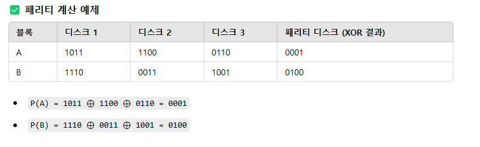

# 7장. 패리티 비트

# RAID4

RAID 4는 **전용 패리티 디스크**를 사용하여 데이터 복구를 지원하는 방식.

즉, 데이터는 여러 개의 디스크에 저장되고, **패리티 디스크는 오류 복구를 위한 정보를 저장**.

RAID 4는 데이터를 **블록 단위로 스트라이핑**하며, **한 개의 디스크를 패리티 전용 디스크로 사용**.

<br>

### **패리티 계산 방법 (XOR 연산)**

RAID에서 패리티는 XOR 연산을 이용하여 계산.

XOR 연산의 특징:

- 배타적 논리합(Exclusive OR)
- **같은 값끼리 XOR하면 0이 됨** (예: 1 ⊕ 1 = 0, 0 ⊕ 0 = 0)
- **다른 값끼리 XOR하면 1이 됨** (예: 1 ⊕ 0 = 1, 0 ⊕ 1 = 1)
- **A ⊕ B ⊕ C = P → P와 남은 값으로 데이터 복구 가능**



### **RAID 4에서 데이터 복구 과정**

만약 **디스크 2가 손실되었다고 가정**하면, 패리티를 이용하여 데이터를 복구 가능

### **손실된 데이터: 디스크 2의 B2 (0011)**

- 기존 데이터: `B1 = 1110`, `B3 = 1001`, `P(B) = 0100`
- 패리티 공식: `B1 ⊕ B2 ⊕ B3 = P(B)`
- 데이터 복구: `B2 = P(B) ⊕ B1 ⊕ B3`
  ```yaml
  B2 = 0100 ⊕ 1110 ⊕ 1001
  = 0011  (원래 데이터와 동일)
  ```

<br>

# 병목(Bottleneck) 발생 이유


### 쓰기 연산이 발생할 때 RAID 4의 과정:

1. 데이터를 디스크에 씀.
2. **패리티 디스크에서 기존 패리티를 읽음**.
3. **새로운 데이터와 기존 데이터를 XOR 연산하여 패리티 갱신**.
4. **새로운 패리티 값을 패리티 디스크에 씀**.

**문제점**

- **모든 쓰기 연산이 패리티 디스크를 거치므로, 패리티 디스크가 병목이 됨**.
- **동시에 여러 개의 데이터 쓰기가 발생하면, 패리티 디스크가 과부하됨**.

<br>

### **모든 쓰기 연산에서 패리티 디스크가 갱신됨**

- RAID 4에서 데이터를 쓰면, **해당 블록의 패리티도 변경되어야 함**.
- 하지만 **패리티는 오직 하나의 전용 디스크에 저장**되므로,
  → 모든 쓰기 연산이 패리티 디스크를 거쳐야 함.
  → **패리티 디스크가 병목이 됨**.

<br>

# RAID5

RAID 5는**패리티 정보를 모든 디스크에 분산 저장하여 성능과 장애 복구 능력을 향상**시킨 RAID 방식.즉, RAID 4처럼 **패리티 전용 디스크가 있는 게 아니라, 모든 디스크에 패리티 블록이 분산.**


### 병목 해결

- **RAID 5는 패리티를 모든 디스크에 나누어 저장**하여 특정 디스크에 부하가 집중되지 않음.
- **쓰기 연산이 여러 디스크에서 동시에 발생 가능하여 속도 향상**.

<br>
<br>
