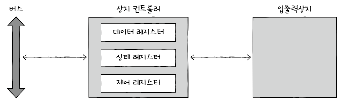

# 8장 입출력 장치

- 장치 컨트롤러에 대한 이해
- 장치 드라이버에 대해 이해
- 프로그램 입출력 방식
- 인터럽트 기반의 입출력 방식
- DMA 입출력 방식 이해

 

# 8.1 장치 컨트롤러와 장치 드라이버

 

## ✅장치 컨트롤러

<aside>
💡입출력 장치는 CPU 메모리보다 더 다루기가 까다롭다. 왜?

</aside>

 

1. 입출력 장치에는 종류가 너무많다
   - 장치마다 속도,데이터,전송 형식등도 다양하다
   - 다양한 입출력 장치와 정보를 주고받는 방식을 규격화 하기 어렵다.
2. CPU와 메모리의 데이터 전송률은 높지만 입출력 장치의 데이터 전송률은 낮다.
   - **전송률**:데이터를 얼마나 빨리 교환할 수 있는지를 나타내는 지표
     ### **전송률의 단위**
     전송률은 보통 다음과 같은 단위로 표현:
     - **bps (bits per second)**: 초당 몇 비트(bit)를 전송하는지 나타냄 → 네트워크 전송 속도에서 주로 사용 (ex: 100 Mbps)
     - **Bps (Bytes per second)**: 초당 몇 바이트(byte)를 전송하는지 나타냄 (1 Byte = 8 bits)
       - **KB/s (Kilobytes per second)**
       - **MB/s (Megabytes per second)**
       - **GB/s (Gigabytes per second)**

### **장치 컨트롤러**

장치 컨트롤러는 **CPU와 입출력 장치(I/O Device) 사이에서 데이터를 중재하는 하드웨어.**

쉽게 말해 **"입출력 장치를 관리하는 일종의 미니 CPU"**

### 역할

1. **CPU와 입출력 장치 간의 통신 중개**
   - CPU가 직접 I/O를 제어하지 않도록 도와주고, 다양한 데이터 전송 방식(인터럽트, DMA 등)을 활용함
2. **오류 검출**
   - 데이터 전송 중 발생할 수 있는 오류를 감지하고, 필요하면 수정함 (패리티 비트, 체크섬, CRC 등).
     ### **오류 검출 (Error Detection)**
     장치 컨트롤러는 **입출력 장치에서 데이터가 전송될 때 오류가 발생하지 않았는지 검사하는 역할**
     - 데이터 전송 중 **노이즈, 신호 손실, 충돌** 등의 이유로 오류가 발생할 수 있음.
     - 오류가 있는 데이터를 그대로 사용하면 프로그램이 오작동할 수 있음.
     ### **주요 오류 검출 기법**
     1. **패리티 비트(Parity Bit) 검사**
        - 데이터에 추가적인 **검사 비트**를 붙여서 오류를 감지함.
        - 단순한 방식이지만, 오류 정정은 불가능.
          - **일반 패리티 비트**
            - 1비트 오류 감지는 가능하지만,**오류가 발생한 위치를 알 수 없어 복구 불가능**
          - **RAID 4의 패리티**
            - 여러 디스크에서 데이터를 XOR 연산으로 계산하여**손실된 데이터를 복구 가능**
            - RAID에서는 **패리티 디스크가 여러 개의 데이터 블록을 비교하면서 XOR 연산을 수행**할 수 있기 때문에 데이터 복구가 가능함
     2. **체크섬(Checksum) 검사**
        - 전송된 데이터의 합계를 계산해서 비교하는 방식.
        - 네트워크 데이터 전송에서 많이 사용됨.
     3. **CRC(Cyclic Redundancy Check) 검사**
        - 다항식을 이용한 고급 오류 검출 방법.
        - 디스크 저장 장치, 네트워크 통신 등에 활용됨.
     4. **에러 정정 코드(ECC, Error-Correcting Code)**
        - 오류를 단순 검출하는 것이 아니라 **수정까지 가능**.
        - RAM(메모리)이나 SSD 같은 저장 장치에서 사용됨.
3. **데이터 버퍼**
   - CPU와 I/O 장치 간 속도 차이를 해결하고 원활한 데이터 흐름을 유지하도록 도와줌.

 

### **장치 컨트롤러의 구조**

- **데이터 레지스터** 데이터를 저장하는 곳.
- **상태 레스터** : 입출력 장치가 입출력 작업을 할 준비가 되었는지,오류는 없는지 등의 상태정보가 저장.
- **제어 레지스터**: 입출력 장치가 수행할 내용에 대한 제어 정보와 명령을 저장

- **버스 인터페이스**: CPU 및 메모리와 연결되는 인터페이스.
- **장치 인터페이스**: 실제 하드웨어(예: 키보드, 마우스, 프린터, 디스크)와 연결되는 부분.

**장치 컨트롤러는 여러 개의 장치를 제어할 수도 있고, 하나의 장치만 제어할 수도 있음.**

예를 들어, **디스크 컨트롤러**는 여러 개의 하드디스크를 제어할 수 있지만, **키보드 컨트롤러**는 키보드 하나만 관리함.

 

## ✅장치 드라이버

- 입출력장치를 연결하기 위한 소프트웨어적인 통로
- 장치 컨트롤러가 컴퓨터 내부와 정보를 주고받을 수 있게 하는 프로그램

 

# 8.2 다양한 입출력 방법

<aside>
💡 **장치 컨트롤러**가 CPU 및 메모리와 데이터를 주고받는 방식은 크게 **세 가지**

</aside>

**1 프로그램 입출력**

- CPU가 직접 장치 컨트롤러에게 명령을 주고 데이터를 전송하는 방식.
- CPU가 계속해서 입출력 장치의 상태를 확인해야 해서 비효율적.
- **단점**: CPU가 I/O 작업을 수행하는 동안 다른 작업을 하지 못함.

**2 인터럽트 기반 입출력**

- 입출력 장치가 데이터 전송을 마치면 CPU에게 **인터럽트(Interrupt)** 를 보내 알림.
- CPU는 다른 작업을 하다가 인터럽트를 받으면 데이터를 처리함.
- **장점**: CPU가 불필요하게 대기할 필요 없음.

**3 DMA(Direct Memory Access) 입출**

- 장치 컨트롤러가 CPU 개입 없이 **메모리(RAM)와 직접 데이터 전송**.
- CPU는 데이터 전송을 신경 쓰지 않고 다른 작업 수행 가능.
- **장점**: CPU 부하가 줄어들고 시스템 성능이 향상됨.
- **예)** 대용량 데이터 전송 (디스크에서 메모리로 파일 읽기)

 

## ✅**프로그램 입출력 방식**

- 프로그램 속 명령어로 입출력 장치를 제어
- CPU가 프로그램 속 명령어를 실행하는 과정에서 **입출력 명령어를 만나면** CPU는 입출력 장치에 연결된 장치 컨트롤러와 상호 작용하며 작업 수행

- CPU가 장치 컨트롤러의 레지스터 값을 읽고 씀으로써 이루어짐

    <aside>
    💡
    
    CPU는 입출력 장치들의 주소를 어떻게 아는가??
    
    </aside>

- **메모리 맵 입출력**
  - **메모리**에 접근하기 위한 **주소 공간**과 **입출력장치**에 접근하기 위한 **주소 공간**을 **하나의 주소 공간으로 간주**하는 방법
- **고립형 입출력**
  - 메모리를 위한 주소 공간과 입출력장치를 위한 **주소 공간 분리하는 방법**
  - 제어 버스에 메모리 읽기/쓰기 선과 별개로 입출력장치 읽기/쓰기 선 생성
    - 메모리 1024 주소공간, 입출력 장치 1024 주소 공간 활용

 

## ✅인터럽트 기반 입출력

- 입출력장치에 의한 하드웨어 인터럽트는 정확히 말하자면 입출력장치가 아
  닌 장치 컨트롤러에 의해 발생.
- CPU는 장치 컨트롤러에 입출력 작업을 명령하고, 장치 컨트롤러가 입출력장치를 제어하며 입출력을 수행하는 동안 CPU는 다른 일을 할 수 있음

- 장치 컨트롤러가 입출력 작업을 끝낸 뒤 CPU에게 인터럽트 요청 신호를 보내면 CPU는 하던 일을
  잠시 백업하고 인터럽트 서비스 루틴을 실행

### 우선순위

- 현재 CPU가 인터럽트 A를 처리하는 도중에 또 다른 인터럽트 B가 발생했다고 가정.
- 만약 지금 처리 중인 인터럽트 A보다 B의 우선순위가 낮다면 CPU는 A를 모두 처리한 뒤 B를 처리
- 하지만 인터럽트 A보다 B의 우선순위가 높다면 CPU는 인터럽트 A의 실행을 잠시 멈추고 인터럽트 B를 처리한 뒤 다시 A를 처리함

### PIC(Programmable Interrupt Controller)

1.  PIC가 장치 컨트롤러에서 인터럽트 요청 신호(들)를 받아들임
2.  PIC는 인터럽트 우선순위를 판단한 뒤 CPU에 처리해야 할 인터럽트 요청 신호를 보냄
3.  CPU는 PIC에 인터럽트 확인 신호를 보냄
4.  PIC는 데이터 버스를 통해 CPU에 인터럽트 벡터를 보냄.
5.  CPU는 인터럽트 벡터를 통해 인터럽트 요청의 주체를 알게 되고, 해당 장치의 인터럽트 서비
    스 루틴을 실행.

- PIC 를 두개 이상 계층적으로 구성

### **마스터 PIC와 슬레이브 PIC**

현대 시스템에서는 8개의 IRQ만으로는 부족했기 때문에, **두 개의 PIC를 연결하여 16개의 IRQ를 지원**

- **마스터 PIC** (IRQ 0~7)
- **슬레이브 PIC** (IRQ 8~15) → 마스터 PIC의 IRQ 2에 연결됨.
-

- **우선순위는 IRQ 번호가 낮을수록 높음.**
  - **IRQ 0 (시스템 타이머)** → 가장 높은 우선순위
  - **IRQ 1 (키보드)** → 타이머 다음으로 높은 우선순위
  - **IRQ 2 (슬레이브 PIC 연결)** → 마스터 PIC가 슬레이브 PIC의 요청을 받으므로 중간 수준
  - **IRQ 15 (보조 HDD 컨트롤러)** → 가장 낮은 우선순위

**즉, 타이머와 키보드는 항상 가장 먼저 처리되며, 하드디스크, 네트워크, 사운드 카드 등은 상대적으로 낮은 우선순위를 가짐**

### **PIC의 한계점**

1. **고정된 우선순위 문제**
   - IRQ 0(타이머)이 항상 가장 높은 우선순위를 가짐.
   - 네트워크 카드(IRQ 9)의 우선순위가 낮아서 성능 저하 문제 발생.
2. **멀티코어 지원 불가**
   - PIC는 단일 CPU 시스템을 기준으로 설계됨.
   - 멀티코어 CPU에서는 인터럽트를 여러 개의 코어에 분배하는 기능이 필요하지만, PIC는 이를 지원하지 못함.
3. **IRQ 부족 문제**
   - 16개의 IRQ만 지원 → 더 많은 장치가 필요할 경우 부족해짐.

### **현대 시스템에서의 대체 기술: APIC**

현재는 **APIC(Advanced PIC)** 또는 **IOAPIC (I/O APIC)** 가 사용되며, 주요 특징은 다음과 같음

- **더 많은 IRQ 지원** (최대 256개)
- **멀티코어 시스템 지원**
- **동적 인터럽트 우선순위 설정 가능**
- **인터럽트를 여러 CPU 코어로 분배 가능**

**즉, 현대 시스템에서는 APIC를 사용하고, 과거의 PIC는 더 이상 사용되지 않음.**

그러나 BIOS 설정에서 "PIC 모드"를 선택할 수도 있으며, 일부 레거시 시스템에서는 여전히 PIC가 사용됨.

 

## ✅DMA 입출력

- 앞선 두 방식은 입출력장치와 메모리 사이에 전송되는 모든 데이터가 반드시 CPU를 거쳐야 함. 가뜩이나 바쁜 CPU는 입출력장치를 위한 연산 때문에 시간을 뺏기게 됨
- 하드 디스크 백업과 같이 대용량 데이터를 옮길 때는 CPU 부담이 더욱 커지고 그래서 입출력장치와 메모리가 CPU를 거치지 않고도 상호작용할 수 있는 입출력 방식인 DMA Direct Memory Access가 등장.
- DMA는 이름 그대로 직접 메모리에 접근할 수 있는 입출력 기능. DMA 입출력을 하기 위해서는 시스템 버스에 연결된 DMA 컨트롤러라는 하드웨어가 필요.

 

## **DMA 입출력 과정**

**1. CPU가 DMA 컨트롤러에 명령을 전달**

- CPU는 DMA 컨트롤러에게 **"이제부터 특정 장치와 메모리 간에 데이터를 전송해라"** 라는 명령을 보냄.
- 이때 CPU는 **출발지 주소, 목적지 주소, 데이터 크기** 등의 정보를 설정함.

**2. DMA 컨트롤러가 데이터 전송 수행**

- CPU는 다른 작업을 수행하면서 **DMA 컨트롤러가 직접 메모리와 I/O 장치 간 데이터를 주고받도록 맡김.**
- CPU는 **데이터 전송 과정에 개입하지 않음.**

**3. 데이터 전송 완료 후 인터럽트 발생**

- DMA 컨트롤러가 **데이터 전송을 완료하면 CPU에게 인터럽트(Interrupt)를 보냄.**
- CPU는 인터럽트를 받아서 **데이터가 정상적으로 전송되었는지 확인**하고, 후속 작업을 수행함.

### 입출력 버스

- DMA를 위해 시스템 버스를 너무 자주 사용하면 그만큼 CPU가 시스템 버스를 이용하지 못함.
- 이 문제는 DMA 컨트롤러와 장치 컨트롤러들을 입출력 버스input/output bus라는 별도의 버스에 연결하여 해결할 수 있음.
- 장치 컨트롤러들이 시스템 버스가 아닌 입출력 버스로 DMA 컨트롤러에 연결된다면 DMA 컨트롤러와 장치 컨트롤러가 서로 데이터를 전송할 때는 시스템 버스를 이용할 필요가 없으므로 시스템 버스의 사용 빈도를 줄일 수 있음

### 한계

**작은 데이터 전송에는 비효율적**

- DMA는 **대량의 데이터를 전송할 때 가장 효과적**이지만, **작은 데이터(예: 키보드 입력, 마우스 움직임)에서는 오히려 성능이 낮아짐.**
- 예를 들어, **키보드 입력 같은 작은 데이터를 처리할 때는 프로그램 방식 I/O나 인터럽트 방식이 더 적합함.**
- **DMA를 사용하면 오히려 설정 및 인터럽트 오버헤드가 커질 수 있음.**

**데이터 동기화 문제**

- CPU와 DMA가 동시에 메모리에 접근하면 **데이터 동기화(Synchronization) 문제**가 발생할 수 있음.
- 특히 **캐시 일관성(Cache Coherency) 문제**가 발생할 수 있음.
  - CPU는 캐시에 데이터를 저장하고 작업하는데, DMA는 메모리에서 직접 데이터를 가져옴.
  - **DMA가 변경한 데이터를 CPU 캐시가 반영하지 못하면, 오류가 발생할 수 있음.**
  - 이를 해결하려면 **캐시 플러시(Cache Flush) 또는 메모리 동기화 기술**이 필요함.
