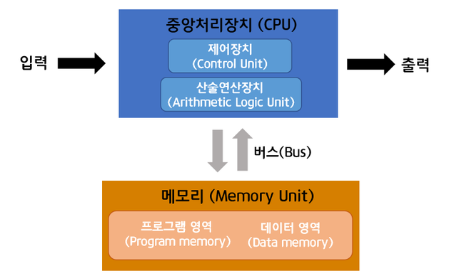

# 폰 노이만 구조

## 폰 노이만 구조

- 폰 노이만 구조는 중앙처리장치(CPU), 메모리, 프로그램 세 가지 요소로 구성. CPU와 메모리는 서로 분리되어 있고 둘을 연결하는 버스를 통해 명령어 읽기, 데이터의 읽고 쓰기가 가능. 이때 메모리 안에 프로그램과 데이터 영역은 물리적 구분이 없기 때문에 명령어와 데이터가 같은 메모리, 버스를 사용하게 됨. 다시 말해, 외나무다리와 같은 버스를 통해 CPU가 명령어와 데이터에 동시 접근할 수 없음.

- 이 구조의 가장 큰 장점은 프로그램 내장 방식 컴퓨터.
    - 이전 컴퓨터는 1+1, 3-2 라는 두 가지의 명령을 수행하려면 하드웨어의 전선을 직접 1, 더하
    기, 1, 3, 빼기, 2를 의미하는 것으로 매번 바꿔 끼워 입력해야 했으나 폰 노이만 구조에서
    는 더하기, 빼기 기능을 담은 소프트웨어가 메모리 안에 내장. 그래서 계산이 필요할
    때마다 메모리 안의 프로그램과 데이터를 CPU에 전달하여 계산을 처리.
- 여기서 CPU가 메모리에 저장된 명령어를 받아와 계산할 때 메모리로부터 명령어를 가져오는
fetch, 명령어의 의미를 해석하는 decode, 명령어를 실행하는 execute, 결과를 저장하는 store의
순서로 처리. 또한 폰 노이만 구조는 내장 메모리 순차처리 방식'을 따르고 있기 때문에 CPU
는 순차적으로 한 번에 명령어 하나씩 실행.

## 병목 현상

- 폰 노이만 구조는 인간의 사고과정을 참고해 구조를 설계. 우리가 어떤 연산을 마주했을
때, 머릿 속의 기억을 불러와서 계산하는 과정과 아주 유사 하지만 이 방식에는 치명적인 단
점이 존재, 우리의 뇌에서 빠르게 계산을 처리할 수 있어도 기억을 불러오는 속도가 느리면
전체적으로 속도가 느려짐. 즉, 계산 속도가 기억장치 속도에 영향을 받음. 기
억장치의 속도가 전체 시스템의 성능 저하를 야기하는 이 현상을 폰 노이만 병목현상(Von-
Neumann Bottleneck)이라고 함.

- 이를 해결하기 위해 다양한 기술 및 구조들이 등장. 하버드 구조, 메모리 계층 구조,
NUMA 등 여러 방법을 통해 한계를 극복하고자 함.
- 하버드 구조: 병목현상이 일어나는 근본적 원인은 프로그램 메모리와 데이터 메모리가
물리적 구분 없이 하나의 버스를 통해 CPU와 교류하기 때문. 이러한 구조에 의해 CPU는 명
령어와 데이터에 동시에 접근이 불가능하고 나열된 명령을 한 번에 하나씩 읽고 쓰게 됨. 이에
반해, 하버드 구조는 CPU가 명령어와 데이터를 동시에 사용할 수 있도록 명령용 버스와 데이터용
버스를 물리적으로 구분. 이를 통해 현재 명령의 처리를 끝냄과 동시에 다음 명령을 읽어 들
일 수 있기 때문에 기존의 폰 노이만 구조보다 더 빠른 속도를 낼 수 있음.
- 현대에 이르러서는 CPU의 외부적으로는 폰 노이만 구조를, 내부적으로는 하버드 구조를 적용하여 속도가 향상된 컴퓨터가 많이 등장. 이를 통해 병목현상은 어느 정도 완화되었지만 이 또한 폰 노이만 구조를 기반으로 만들어진 것이기 때문에 근본적인 원인 해결은 되지 않음.

## 또 다른 문제점, CPU의 비효율적 활용

- 또 하나의 문제점은, 순차적으로 한 번에 하나의 명령어만을 처리하기 때문에 CPU를 효율적으로 사용하지 못한다는 점. 폰 노이만 구조의 순차처리 방식은 수치 계산이나 정밀하게 작성된 프로
그램을 실행하는 데에는 탁월하지만, 이미지나 소리와 같은 아날로그 데이터를 처리하는 데에는 효율성이 낮다는 한계가 있음.
- 이를 해결하기 위해 한 번에 여러 개의 명령어를 처리하는 방법들을 고안, 명령어 병렬처
리, 대칭형 다중처리(SMP), 대규모 병렬 컴퓨터(MPP) 등 다양한 병렬처리 방식(parallel
processing)이 등장. 병렬처리 방식은 하나의 프로그램을 여러 개의 프로세서로 분담하
여 동시에 처리함으로써 처리 속도의 향상과 높은 효율성을 추구하는 기술.
- 그러나 병렬처리를 기반으로 하는 컴퓨터 구조를 만들기에는 지나치게 복잡하다는 점과 모든 문제에 효율적으로 적용되는 것이 아니라는 점, 처리를 위해 부가적으로 시간이 들어가는 오버헤드
(overhead)가 발생한다는 점 등 여러 단점으로 인해 폰 노이만 구조를 완전히 대체하기에는 적절하지 않음