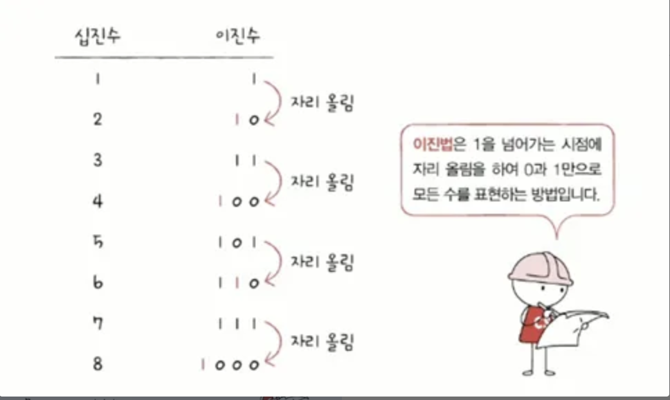
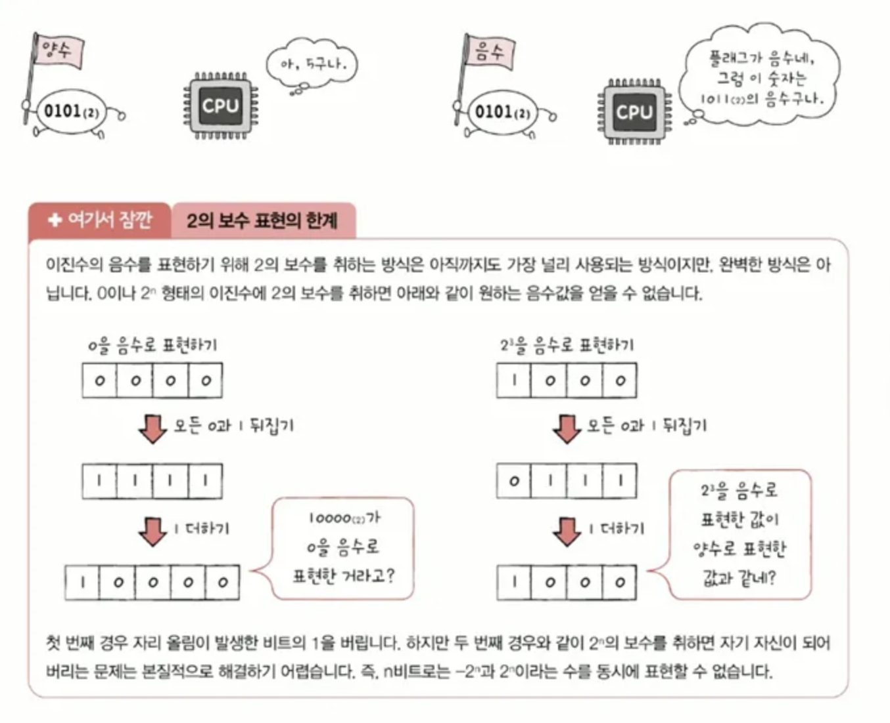
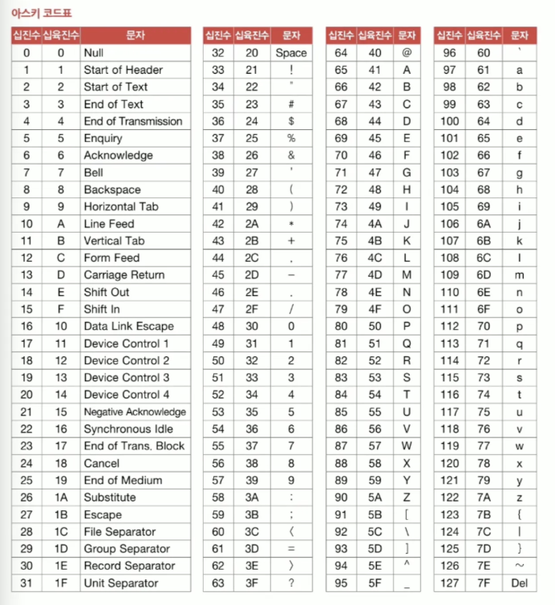
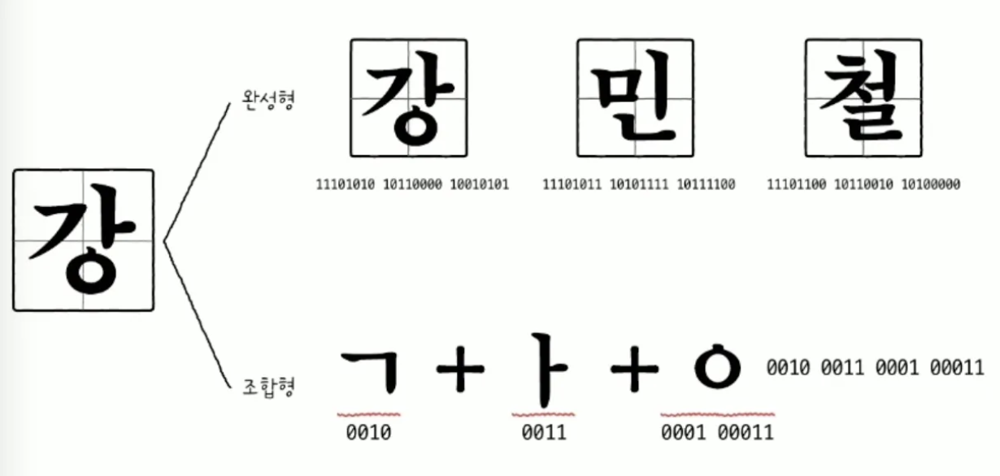
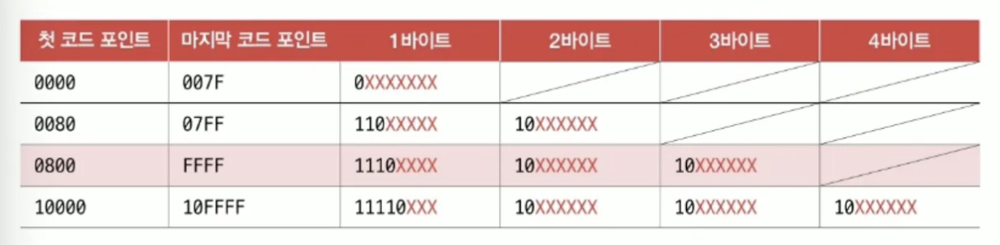
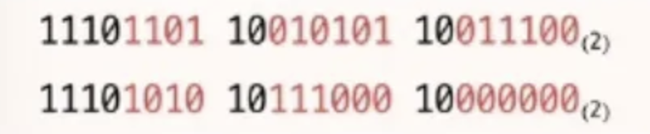

# Chapter 02. 데이터

## 02-1. 0과 1로 숫자를 표현하는 방법

컴퓨터가 표현하는 정보 단위를 학습하고, 0과 1만으로 숫자를 표현하는 방법 배우기

### 정보 단위
---
- n개의 전구로 표현할 수 있는 상태는 2^n가지임

| 1바이트(1byte) | 8비트(8bit) |
| --- | --- |
| 1킬로바이트(1kB) | 1,000바이트(1,000byte) |
| 1메가바이트(1MB) | 1,000킬로바이트(1,000kB) |
| 1기가바이트(1GB) | 1,000메가바이트(1,000MB) |
| 1테라바이트(1TB) | 1,000기가바이트(1,000GB) |

---

- 이진법 : 0과 1만으로 숫자를 표현하는 방법
- 이진수 표기 방식
    - 이진수 끝에 아래 첨자`(2)`를 붙이거나 이진수 앞에 `0b`를 붙임

### 이진수의 음수 표현

---

- 십진수 음수 표현은 단순히 숫자 앞에 마이너스 부호를 붙이면 됨
    - -1, -3, -5 등
- `2의 보수`
    - 0과 1만으로 음수를 표현하는 방법 중 가장 널리 사용되는 방법
    - `어떤 수를 그보다 큰 2^n에서 뺀 값`
        - 11(2)의 2의 보수는 100(2)에서 11(2)을 뺀 01(2)이 됨
    - `모든 0과 1을 뒤집고(1의 보수), 거기에 1을 더한 값(2의 보수)`
        - 11을 뒤집고 00에서 1을 더하면 01(2)이 됨
    - 2의 보수의 2의 보수는 원래 자기 자신의 값이 됨
- 플래그
    - 실제로 이진수만 봐서는 음수인지 양수인지 구분하기 어려움
    - 이를 구분하기 위해 플래그(부가정보)를 사용함

### 십육진수법

---

- 십육진수 : 한 글자당 열여섯 종류(0~9, A~F)의 숫자를 표현할 수 있음
- 십육진수 표기 방식
    - 이진수 끝에 아래 첨자`(6)`를 붙이거나 이진수 앞에 `0x`를 붙임
- 십육진법을 사용하는 주된 이유 중 하나는 이진수를 십육진수로, 십육진수를 이진수로 변환하기 쉽기 때문

### 십육진수를 이진수로 변환하기

---

- 십육진수 한 글자를 4비트의 이진수로 간주하기
- 각 글자를 따로따로 이진수로 변환한 후 그대로 이어 붙이면 이진수로 변환됨
- 1A2B(16) → 0001(2) 1010(2) 0010(2) 1011(2)

### 이진수를 십육진수로 변환하기

---

- 이진수 숫자를 네 개씩 끊고, 끊어준 네 개의 숫자를 하나의 십육진수로 변환한 뒤 이어붙이기
- 11010101(2) → 1101(2) 0101(2) → D(16)5(16)

## 02-2. 0과 1로 문자를 표현하는 방법

### 문자 집합과 인코딩

- 문자 집합 : 컴퓨터가 인식하고 표현할 수 있는 문자의 모음
- 문자 인코딩 : 문자 집합에 속한 문자를 0과 1로 변환하는 것
- 문자 디코딩 : 0과 1로 이루어진 문자 코드를 사람이 이해할 수 있는 문자로 변환하는 과정

### 아스키코드

- 아스키(`ASCII`)
- 초창기 문자 집합 중 하나로, 영어 알파벳, 아라비아 숫자, 일부 특수 문자 포함
- 128개의 문자 표현
- 아스키 문자에 대응된 고유한 수를 `아스키 코드`라고 함
    - A → 65
    - a → 97

### EUC-KR

- 한글은 각 음절 하나하나가 초성, 중성, 종성의 조합으로 이루어져 있음
- 한글 인코딩 방식 두 가지
    - 완성형
        - 초성, 중성, 종성의 조합으로 이루어진 완성된 하나의 글자에 고유한 코드를 부여하는 인코딩 방식
        - 가 → 1, 나 → 2, 다 → 3
    - 조합형
        - 초성을 위한 비트열, 중성을 위한 비트열, 종성을 위한 비트열을 할당하여 그것들의 조합으로 하나의 글자 코드를 완성하는 방식
- EUC-KR은 대표적인 완성형 인코딩 방식으로, 한 글자에 2바이트 크기 부여함
- 제한된 한글 표현 문제로, 마이크로소프트의 CP949가 나타남

### 유니코드와 UTF-8

---

- 대부분 나라의 문자, 특수문자, 화살표나 이모티콘까지도 코드로 표현할 수 있는 통일된 문자 집합
- 각 문자마다 고유한 값이 부여됨
- 글자에 부여된 값 자체를 인코딩 값으로 삼지 않고, 이 값을 다양한 방법으로 인코딩함
    - UTF-8
    - UTF-16
    - UTF-32

> UTF는 Unicode Transformation Format의 약어로, 유니코드를 인코딩하는 방법이다.

> ### UTF 인코딩 예시
> `한`과 `글`에 부여된 값은 각각 D55C(16), AE00(16)이다. 이를 각각 이진수로 표현하면 1101 0101 0101 1100(2), 1010 1110 0000 0000(2)이다.
> `한`과 `글`을 UTF-8방식으로 인코딩한 결과는 아래와 같다.
> 