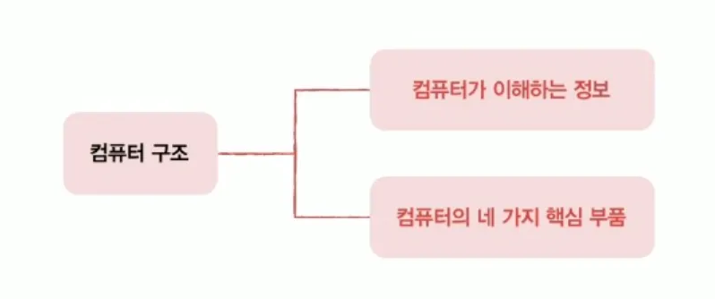
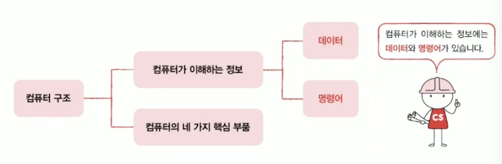
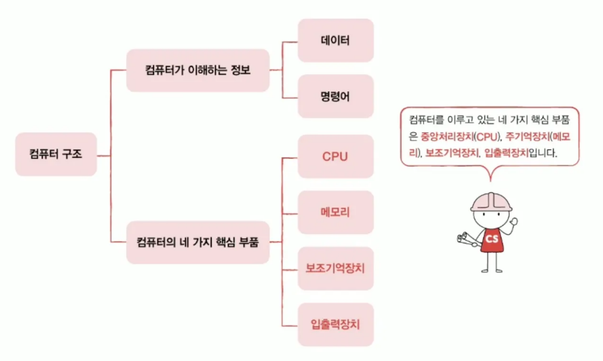
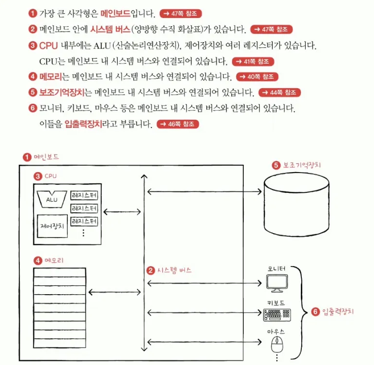
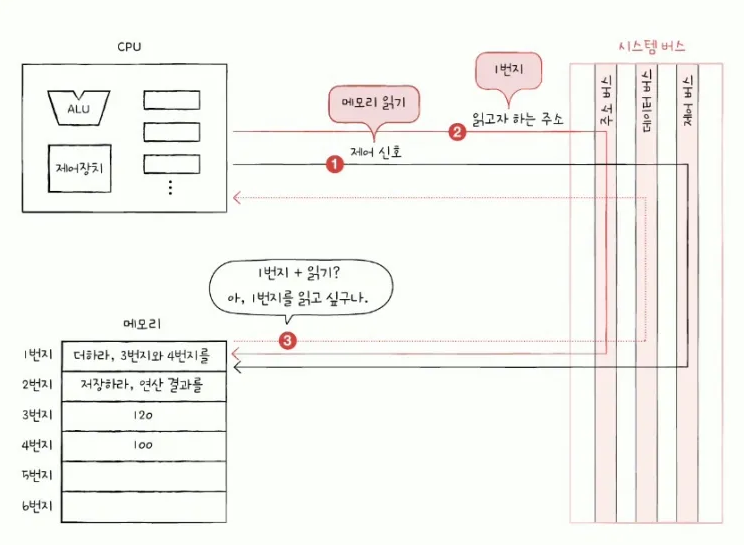
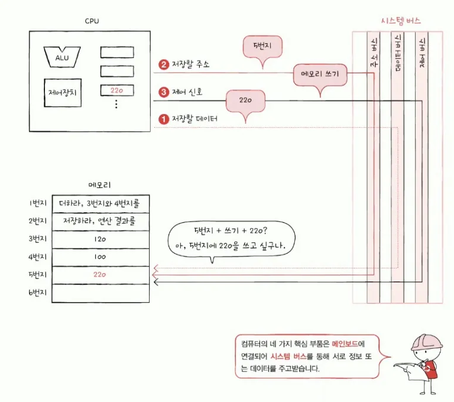

# Chapter 01. 컴퓨터 구조 시작하기

## 01-1. 컴퓨터 구조를 알아야 하는 이유

- 컴퓨터 구조를 이해하면 문제 해결 능력이 향상됨
- 컴퓨터 구조를 이해하면 문법만으로는 알기 어려운 `성능`, `용량`, `비용`을 고려하며 개발할 수 있음

## 01-2. 컴퓨터 구조의 큰 그림

- 컴퓨터 구조 지식
    - 컴퓨터가 이해하는 정보
    - 컴퓨터의 네 가지 핵심 부품

### 컴퓨터가 이해하는 정보

---

- 컴퓨터가 이해하는 정보
    
    0과 1로 표현되는 정보
    
    - 데이터 : 컴퓨터가 이해하는 숫자, 문자, 이미지, 동영상과 같은 정적인 정보
    - 명령어 : 데이터를 움직이고 컴퓨터를 작동시키는 정보

> 💡 컴퓨터 : 명령어를 처리하는 기계

### 컴퓨터의 4가지 핵심 부품

---

- 중앙처리장치 `CPU`
- 주기억장치 `Main Memory`
- 보조기억장치 `Secondary Storage`
- 입출력장치 `Input/Output Device`

> 💡 주기억장치 (메모리)
> - 크게 `RAM`(Random Access Memory)와 `ROM`(Read Only Memory) 두 가지가 있음
> - 보통은 RAM을 지칭함

### 메모리

---

- 메모리
    - 현재 실행되는 프로그램의 명령어와 데이터를 저장하는 부품
    - 저장된 값에 빠르고 효율적으로 접근하기 위해 `주소`를 사용함

<aside>

- 프로그램이 실행되기 위해서는 반드시 메모리에 저장되어 있어야 함
- 메모리는 현재 실행되는 프로그램의 명령어와 데이터를 저장함
- 메모리에 저장된 값의 위치는 주소로 알 수 있음
</aside>

### CPU

---

- CPU
    - 컴퓨터의 두뇌
    - 메모리에 저장된 명령어를 읽어 들이고, 읽어 들인 명령어를 해석하고, 실행하는 부품
- CPU 내부 구성 요소
    - ALU(산술논리연산장치)
        - 계산기
        - 컴퓨터 내부에서 수행되는 대부분의 계산을 도맡아 수행함
    - 레지스터
        - CPU 내부의 작은 임시 저장 장치
        - 프로그램을 실행하는 데 필요한 값들을 임시로 저장함
    - 제어장치
        - 제어 신호라는 전기 신호를 내보내고 명령어를 해석하는 장치

<aside>

- 메모리 읽기
    - CPU가 메모리에 저장된 값을 읽고 싶을 땐 메모리에게 `메모리 읽기` 제어 신호 보냄
- 메모리 쓰기
    - CPU가 메모리에 어떤 값을 저장하고 싶을 땐 메모리를 향해 `메모리 쓰기`라는 제어 신호 보냄
</aside>

> ### 💡 연산 수행 단계
> - `메모리 읽기` 제어 신호
> - 명령어 또는 데이터가 레지스터에 저장됨
> - ALU가 읽어 들인 데이터로 연산을 수행함. 결과는 레지스터에 저장됨
> - `메모리 쓰기`라는 제어 신호 보냄

### 보조기억장치

---

- 메모리의 두 가지 치명적인 약점
    - 가격이 비싸 저장 용량 작음
    - 전원이 꺼지면 저장된 내용 잃어버림

메모리보다 크기가 크고 전원이 꺼져도 저장된 내용을 잃지 않는 메모리를 보조할 저장 장치인 `보조기억장치`가 필요해졌다.

- 보조기억장치 종류
    - 하드 디스크
    - SSD
    - USB 메모리
    - DVD
    - CD-ROM

> ### 💡 메모리 vs. 보조기억장치
> - 메모리
>    - 현재 `실행되는` 프로그램 저장
> - 보조기억장치
>    - `보관할` 프로그램 저장

### 입출력장치

---

- 컴퓨터 외부에 연결되어 컴퓨터 내부와 정보를 교환하는 장치
    - 마이크, 스피커, 프린터, 마우스, 키보드

### 메인보드와 시스템 버스

---

- 메인보드
    - `마더보드`라고도 부름
    - 컴퓨터의 핵심 부품들이 메인보드 판에 연결됨
- 버스
    - `버스`라는 통로를 통해 메인보드에 연결된 부품들은 서로 정보를 주고받음
    - 여러 버스 가운데 네 가지의 핵심 부품을 연결하는 가장 중요한 버스는 `시스템 버스`임
- 시스템 버스
    - 주소 버스
        - 주소를 주고받는 통로
    - 데이터 버스
        - 명령어와 데이터를 주고받는 통로
    - 제어 버스
        - 제어 신호를 주고받는 통로

메모리 읽기 신호

메모리 저장 신호

